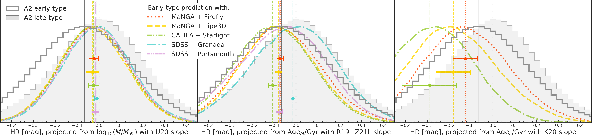

# On the relationship between Type Ia supernova luminosity and host-galaxy properties

note: this repository is work in progress. to request specific files or information, contact the author directly. 

Murakami et al. 2021  
 

> A string of recent studies has debated the exact form and physical origin of an evolutionary trend between the peak luminosity of Type Ia supernovae (SNe Ia) and the properties of the galaxies that host them. We shed new light on the discussion by presenting an analysis of ~200 low-redshift SNe Ia in which we measure the separation of Hubble residuals (HR; as probes of luminosity) between two host-galaxy morphological types. We show that this separation can test the predictions made by recently proposed models, using an independently and empirically determined distribution of each morphological type in host-property space. Our results are partially consistent with the new HR--age slope, but we find significant scatter in the predictions from different galaxy catalogues. The inconsistency in age illuminates an issue in the current debate that was not obvious in the long-discussed mass models: HR--host-property models are strongly dependent on the methods employed to determine galaxy properties. While our results demonstrate the difficulty in constructing a universal model for age as a proxy for host environment, our results indeed identify evolutionary trends between mass, age, morphology, and HR values, encouraging (or requiring, if such trends are to be accounted for in cosmological studies) further investigation. 

## Introduction
Contents are to be added.

## Links to VACs
- CALIFA - [PyCasso VAC](http://www.pycasso.iaa.es/): "Main sample integrated spectra with GMe" ([direct link](http://www.pycasso.iaa.es/tables/pycasso_integrated_main_gsd6e.fits))
- MaNGA - [Pipe3D VAC](https://www.sdss.org/dr15/manga/manga-data/manga-pipe3d-value-added-catalog/): "Catalogue of derived quantities for the galaxies" ([direct link](https://data.sdss.org/sas/dr15/manga/spectro/pipe3d/v2_4_3/2.4.3/manga.Pipe3D-v2_4_3.fits))
- MaNGA - [Firefly VAC](https://www.sdss.org/dr14/manga/manga-data/manga-firefly-value-added-catalog/): "GLOBAL PROP (Minimal data table only including global properties and gradients)" ([direct link](https://data.sdss.org/sas/dr14/manga/spectro/firefly/v1_0_3/manga_firefly-v2_1_2-GLOBALPROP.fits))
- SDSS DR8 - [Granada VAC](https://www.sdss.org/dr12/spectro/galaxy_granada/): Kroupa IMF, wideform, no dust ([direct link](http://data.sdss3.org/sas/dr12/sdss/spectro/redux/galaxy/v1_1/granada_fsps_krou_wideform_nodust-26.fits.gz))
- SDSS DR8 - [Portsmouth VAC](https://www.sdss.org/dr12/spectro/galaxy_portsmouth/): Kroupa IMF, starforming ([direct link](http://data.sdss3.org/sas/dr12/sdss/spectro/redux/galaxy/v1_1/portsmouth_stellarmass_starforming_krou-26.fits.gz))

Morphological classifications:
- CALIFA
- MaNGA
- SDSS

## Acknowledgements

We thank our referee, Benjamin Rose, whose feedback led to a substantial improvement of our initial manuscript. Y.S.M. is also grateful to Mariska Kriek for an eye-opening conversation about SPS models and the diversity in predictions they produce. We thank Thomas deJaeger for helpful discussions on the mass-step and Andrew Hoffman for proofreading. 

A.V.F.’s group at U.C. Berkeley acknowledges generous support from Marc J. Staley, the Christopher R. Redlich Fund, Sunil Nagaraj, Landon Noll, the TABASGO Foundation, and the Miller Institute for Basic Research in Science (U.C. Berkeley).

Funding for the Sloan Digital Sky 
Survey IV has been provided by the 
Alfred P. Sloan Foundation, the U.S. 
Department of Energy Office of 
Science, and the Participating 
Institutions. 

SDSS-IV acknowledges support and 
resources from the Center for High 
Performance Computing  at the 
University of Utah. The SDSS 
website is www.sdss.org.

SDSS-IV is managed by the 
Astrophysical Research Consortium 
for the Participating Institutions 
of the SDSS Collaboration including 
the Brazilian Participation Group, 
the Carnegie Institution for Science, 
Carnegie Mellon University, Center for 
Astrophysics | Harvard \& 
Smithsonian, the Chilean Participation 
Group, the French Participation Group, 
Instituto de Astrof\'isica de 
Canarias, The Johns Hopkins 
University, Kavli Institute for the 
Physics and Mathematics of the 
Universe (IPMU) / University of 
Tokyo, the Korean Participation Group, 
Lawrence Berkeley National Laboratory, 
Leibniz Institut f\"ur Astrophysik 
Potsdam (AIP),  Max-Planck-Institut 
f\"ur Astronomie (MPIA Heidelberg), 
Max-Planck-Institut f\"ur 
Astrophysik (MPA Garching), 
Max-Planck-Institut f\"ur 
Extraterrestrische Physik (MPE), 
National Astronomical Observatories of 
China, New Mexico State University, 
New York University, University of 
Notre Dame, Observat\'ario 
Nacional / MCTI, The Ohio State 
University, Pennsylvania State 
University, Shanghai 
Astronomical Observatory, United 
Kingdom Participation Group, 
Universidad Nacional Aut\'onoma 
de M\'exico, University of Arizona, 
University of Colorado Boulder, 
University of Oxford, University of 
Portsmouth, University of Utah, 
University of Virginia, University 
of Washington, University of 
Wisconsin, Vanderbilt University, 
and Yale University.

This study uses data provided by the Calar Alto Legacy Integral Field Area (CALIFA) survey (http://califa.caha.es/).
CALIFA is based on observations collected at the Centro Astronómico Hispano Alemán (CAHA) at Calar Alto, operated jointly by the Max-Planck-Institut fűr Astronomie and the Instituto de Astrofísica de Andalucía (CSIC).

# See also:
Zhang et al. 2021 
 

(GitHub: https://github.com/ketozhang/statistical-methods-on-sne-ia-luminosity-evolution)

    
